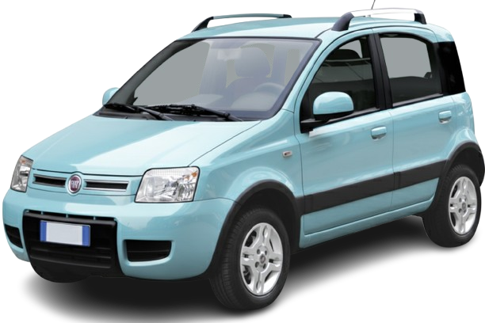

# 🐼 SmartPanda Project

> **Transforming a 2010 Fiat Panda (169) into a fully connected Smart Car.**


-blue?style=for-the-badge)


## 📖 About The Project

**SmartPanda** is an open-source initiative to reverse-engineer and modernize the Fiat Panda 169 platform. By interfacing directly with the vehicle's CAN Bus networks (B-CAN and C-CAN), this project enables remote control via a mobile app, real-time telemetry, and smart automation.

**Target Vehicle:** Fiat Panda (Model 169) - Year 2010

<div align="center">
  <br />
  
  <br /><br />
</div>

---

## 📂 Repository Structure

The repo is a monorepo hosting both sides of the project:

```
SmartPanda/
├── raspberry/          # Everything that runs on the Raspberry Pi
│   ├── setup_can.sh    #   CAN interface bring-up (can0/can1)
│   ├── requirements.txt
│   └── tools/          #   sniffing & live-decoding scripts
├── android/            # Android companion app (Kotlin + Jetpack Compose)
├── dbc/                # Shared CAN message definitions (DBC files)
├── docs/               # Shared docs (reverse-engineered ID maps)
└── assets/             # Images & logos
```

`dbc/` and `docs/` sit at the root because they describe the car's protocol — knowledge shared by the Pi middleware and the app.

---

## ⚡ Hardware & Requirements

### Hardware Components
*   **Core:** Raspberry Pi 3B+ / 4 (Running Raspberry Pi OS Lite)
*   **Interface:** Waveshare 2-CH CAN HAT (MCP2515 based) / CAN Bed
*   **Connection:** OBD-II to DB9 Cable / Custom Wiring harness
*   **Power:** 12V to 5V Step-Down Converter (3A min recommended)

### Software Prerequisites
*   Raspberry Pi OS (Lite recommended)
*   Python 3.7+
*   `can-utils` (for low-level debugging)

---

## 🔌 Wiring Schema (OBD-II to Waveshare HAT)

We tap into both the **C-CAN** (High Speed / Engine) and **B-CAN** (Low Speed / Body) networks.

| Signal | Fiat OBD Pin | Waveshare HAT Terminal | Network ID | Speed | Description |
| :--- | :---: | :---: | :---: | :---: | :--- |
| **VCC** | 16 | 12V | - | - | Power Source (Always On) |
| **GND** | 4 & 5 | GND | - | - | Signal & Chassis Ground |
| **CAN H** | 6 | H (CH 0) | `can0` | **500 kbps** | **C-CAN** (Engine, ABS, City) |
| **CAN L** | 14 | L (CH 0) | `can0` | **500 kbps** | **C-CAN** (Engine, ABS, City) |
| **LS-CAN L**| 1 | L (CH 1) | `can1` | **50 kbps** | **B-CAN** (Body, Lights, Doors) — ⚠️ see warning below |
| **LS-CAN H**| 9 | H (CH 1) | `can1` | **50 kbps** | **B-CAN** (Body, Lights, Doors) — ⚠️ see warning below |

> **⚠️ Warning:** Do NOT power the Raspberry Pi directly from the 12V OBD Pin unless you have a verified HAT with a wide-input voltage regulator. Most HATs only take 5V. Use a dedicated Step-Down converter!

> **🔴 B-CAN transceiver incompatibility:** The Waveshare 2-CH CAN HAT uses **SN65HVD230** transceivers, which implement the **high-speed ISO 11898-2** physical layer. The Fiat B-CAN is a **low-speed fault-tolerant ISO 11898-3** network with different (incompatible) voltage levels and per-node termination. In practice, CH 1 wired to OBD pins 1/9 will most likely read nothing (or only garbage/error frames), and the HAT's 120 Ω differential termination can disturb the car's B-CAN even in listen-only mode (stuck doors, warning lights, etc.).
> **Do not wire OBD pins 1/9 to this HAT.** To read B-CAN you need a fault-tolerant transceiver (e.g. NXP TJA1054/TJA1055) between the bus and the MCP2515. Alternatively, start with C-CAN only: the Body Computer acts as a gateway and mirrors many body events (doors, lights) onto the C-CAN.

---

## 🚀 Quick Start

### 1. Installation

Clone the repository and install dependencies:

```bash
git clone https://github.com/yourusername/SmartPanda.git
cd SmartPanda
pip install -r raspberry/requirements.txt
```

### 2. Configure CAN Interfaces

We have provided a script to automatically bring up the CAN interfaces with the correct bitrates.

```bash
chmod +x raspberry/setup_can.sh
./raspberry/setup_can.sh
```

*This sets `can0` to 500kbps (C-CAN) and `can1` to 50kbps (B-CAN).*

### 3. Verify Connection

Check if the interfaces are up and running:

```bash
ifconfig can0
ifconfig can1
```

---

## 🕵️ Reverse Engineering (Sniffing)

To identify specific packets (e.g., Door Open, Headlights On), use `candump` and `cansniffer` from the `can-utils` package.

**Example: Monitor Body Computer traffic (removing static IDs)**
```bash
cansniffer -c can1
```

*Note: `can1` (B-CAN) only works with a fault-tolerant transceiver (see warning above). Until then, sniff `can0` (C-CAN) — many body events are gatewayed there too.*

Interact with the car (open a window, toggle lights) and watch for changing hex values!

---

## 🗺️ Roadmap

- [x] **Phase 0: Setup**
    - [x] Hardware Interface & Wiring
    - [x] OS Configuration & Network Up (`setup_can.sh`)
- [ ] **Phase 1: Decoding**
    - [ ] B-CAN ID Map (Doors, Lights, Windows)
    - [ ] C-CAN ID Map (RPM, Speed, Engine Temp)
- [ ] **Phase 2: Middleware**
    - [ ] Python Service for message parsing
    - [ ] Database integration (InfluxDB/SQLite)
- [ ] **Phase 3: User Interface**
    - [x] Android app scaffold (`android/`, Kotlin + Jetpack Compose)
    - [ ] Mobile App features / Web Dashboard
- [ ] **Phase 4: Active Control**
    - [ ] Injecting messages to control windows/lights

---

## 🤝 Contributing

Contributions are what make the open source community such an amazing place to learn, inspire, and create. Any contributions you make are greatly appreciated. 

Please verify your changes on a test bench if possible before submitting.

---

## ⚖️ Disclaimer

**USE AT YOUR OWN RISK.**

Modifying car electronics can be dangerous. The authors are not responsible for any damage to your vehicle, voided warranties, or accidents.
*   **Always test with the engine off and the car stationary.**
*   **Do not send active messages to the C-CAN (Engine/ABS) while driving.**
